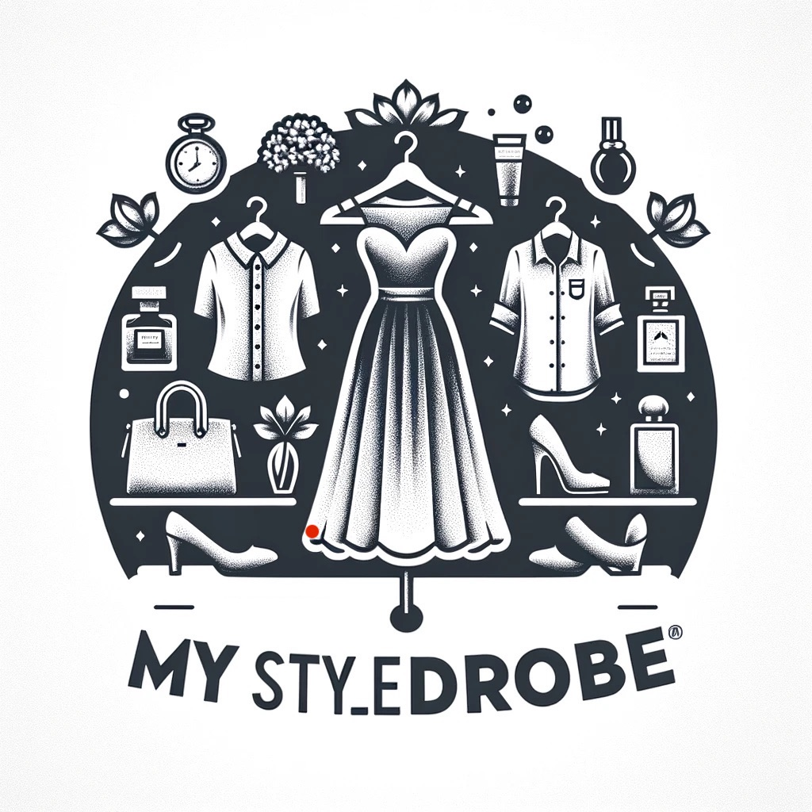
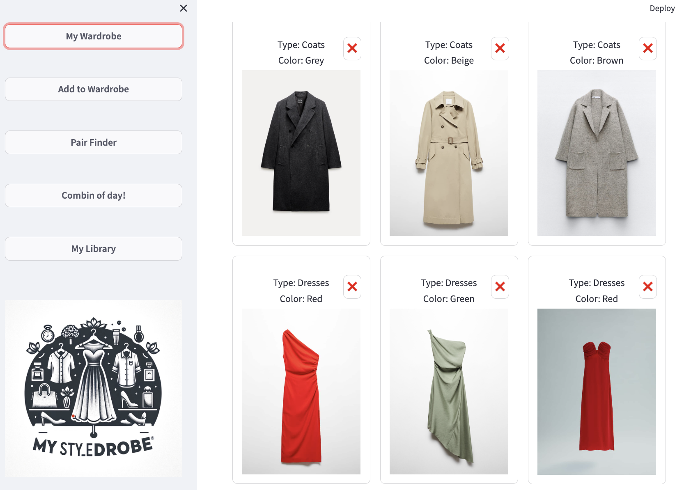
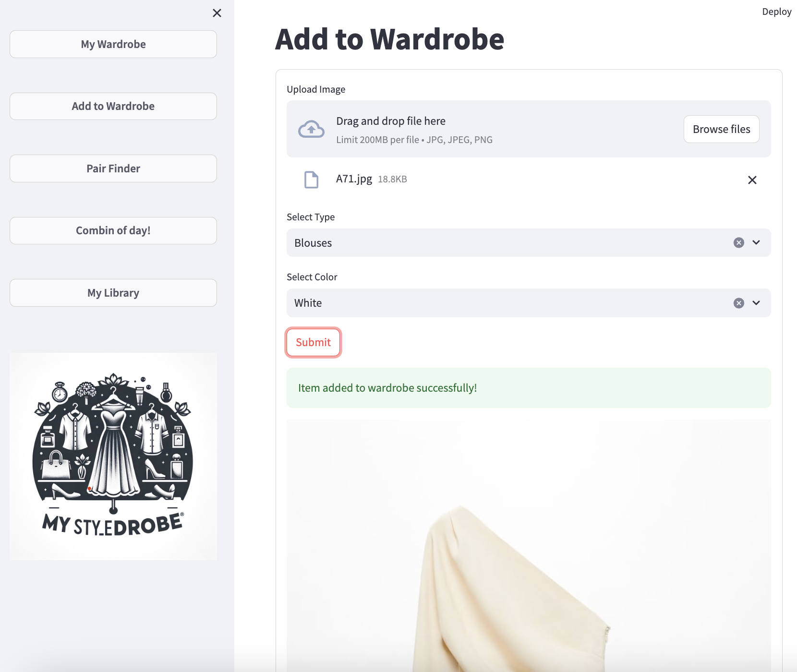
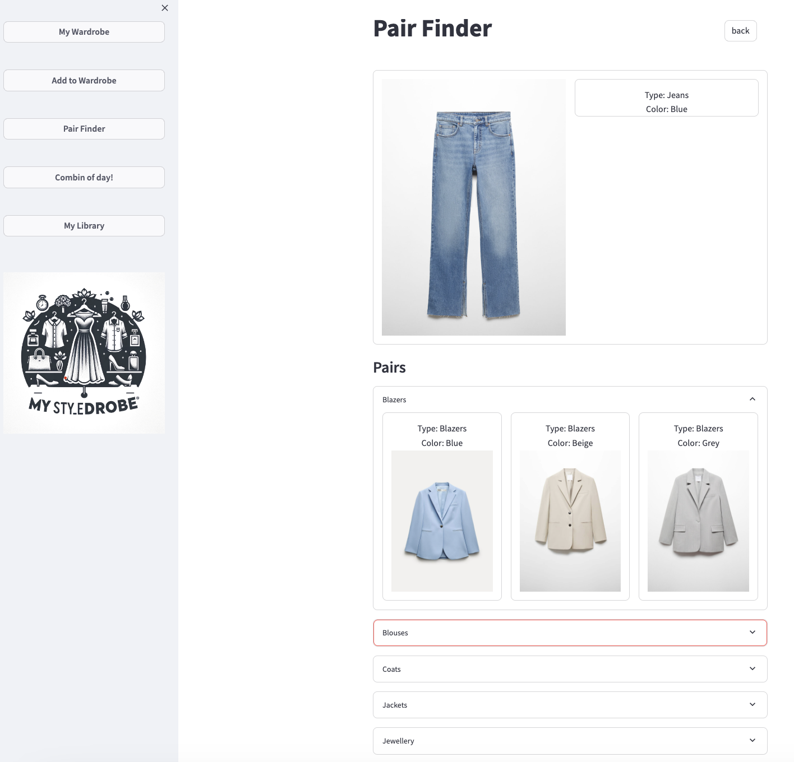
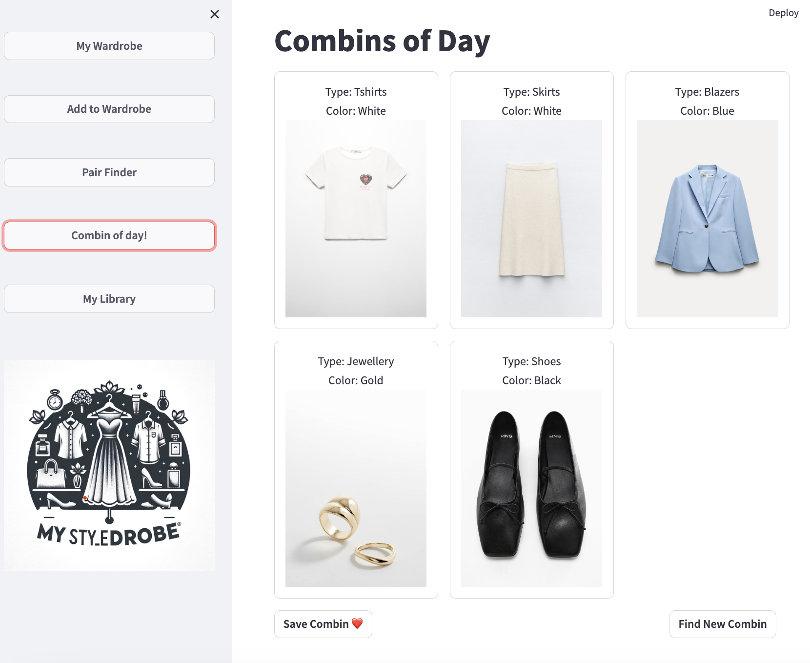
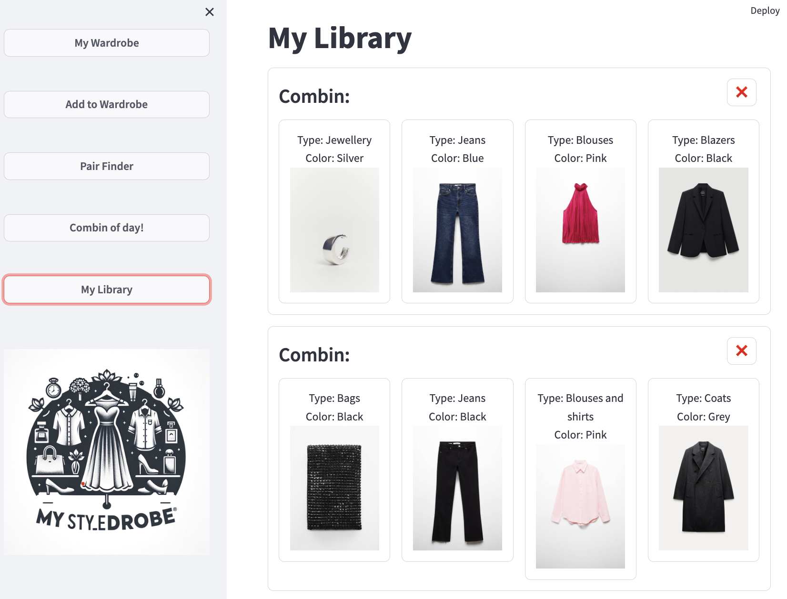

# Project: My Styledrobe - AI Outfit Recommender

    

 **My Styledrobe** simplifies outfit selection by providing users with matching wardrobe items. It starts with scraping clothing data, then cleaning it meticulously for accuracy. A trained machine learning model predicts item compatibility.

The project aims to empower users to effortlessly create stylish outfits. Through an intuitive application interface, users can manage their wardrobe, add items, and generate matching combinations. By leveraging the model's predictive capabilities, users can confidently step out in coordinated outfits.

# Table of Contents

- [Web Scraping](#web-scraping)
- [Data Cleaning](#data-cleaning)
- [Model Generation and Training](#model-generation-and-training)
- [Streamlit](#streamlit)
    * [My Wardrobe Page](#1--my-wardrobe-page)
    * [Add to Wardrobe Page](#2--add-to-wardrobe-page)
    * [Pair Finder Page](#3--pair-finder-page)
    * [Combin of Day Page](#4--combin-of-day-page) 
    * [My Library Page](#5--my-library-page)
- [Future Ideas](#future-ideas)

## Web Scraping

To train the application's model, matching pairs of items are required. This data is obtained by scraping outfit retailer websites. From the recommended sections of these websites, each pair's image link, item type, and color are collected using **Selenium**.

## Data Cleaning

The obtained data was not ideal for training the model due to unwanted and redundant values in the type and color fields. These were analyzed and cleaned accordingly.

Subsequently, using the image links, all item images were downloaded for model training in advance and named corresponding to their identification to match with the dataset.

## Model Generation and Training

For the model training, TensorFlow, Keras and the ResNet50 architecture were utilized.

Categorical data for item type and color were subjected to one-hot encoding, allowing for their input into the model.

ResNet50 was utilized to extract relevant features from clothing item images, resulting in the generation of high-dimensional feature vectors.

The model, incorporating image features and one-hot encoded attributes, underwent development and rigorous testing. Performance evaluation metrics (accuracy) was employed to assess performance.

The resulting model demonstrated promising accuracy in predicting clothing item compatibility, providing a valuable tool for creating coordinated outfits.

## Streamlit 

### 1- My Wardrobe Page

On this page, users can view their wardrobe and delete items. Each item is accompanied by images of outfits, as well as details such as color and type. 

To delete an item, users can tap the X button located above the item cell. 
The updated wardrobe will be saved by overwriting the existing `csv` file.

### 2- Add To Wardrobe Page

On this page, users can add a new item. A user should upload an image of the item, then select the type and color of the item. Afterward, they should tap on the submit button.

If the image is uploaded successfully, it will be displayed below as seen in the snapshot above. Otherwise, an error prompt will be shown.

The `wardrobe.csv` file will be overwritten with the newly added item, and the uploaded image of the item will also be saved to the `streamlit_image` folder as a jpg.

### 3- Pair Finder Page

On this page, users can select an item and view matching pairs from their wardrobe with the selected item.

In the **Pairs** section of the page, every pair is grouped by their category. Users can tap on a category to expand and see the three best matching pairs in that category.

### 4- Combin of Day Page

This page generates matching combin of outfits from the user's wardrobe for the day. Unlike the [**Pair Finder Page**](#3--pair-finder-page), each item in a combin forms part of a complete look, offering ready-to-go outfits.

With the *Save Combin* button, users can store these combins in their library. If a combin doesn't match the user's preferences, they can click the *Find New Combin* button to generate a new one.

Each combin is saved separate **csv** files named with their *combin_id*'s. All combin id's are stored in `save_list.csv`.

### 5- My Library Page

The library contains combins of outfits saved by users from the [Combins of Day Page](#4--combin-of-day-page). Each combin can be viewed along with its constituent items.

Users have the option to delete a saved combin using the **X** button located at the top right of each corresponding combin.

## Future Ideas

- Prefill color from image on [Add to Wardrobe Page](#2--add-to-wardrobe-page)
- Train model for recognition for types from images to prefill *type* on [Add to Wardrobe Page](#2--add-to-wardrobe-page)
- Add Weather forecast option to [Combin of Day Page](#4--combin-of-day-page)
    - Add label to items for weather
    - Train model with new label
    - Add support for fetching today's and tomorrow's weather from API
    - Make prediction with weather parameter

